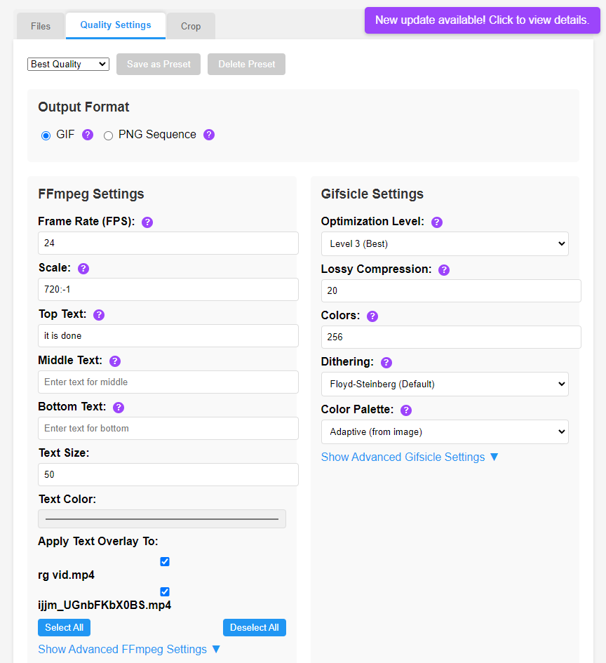

# GIFME - Batch MP4 to GIF Converter


GIFME Batch gif converter is a user-friendly desktop app that can convert batches of MP4s to optimized GIFs with just a few clicks.

## 🚀 What's New in v1.1.0

### New Features
- **Enhanced Cropping Tool**: Improved UI with better visual feedback and crop indicators
- **File Size Estimator**: Predict output file size before conversion
- **Preview Generation**: Generate previews to test your settings before full conversion
- **Text Overlay Support**: Add custom text to the top, middle, or bottom of your GIFs
- **PNG Sequence Output**: Option to output as PNG sequence instead of GIF
- **Expanded Video Format Support**: Now supports MOV, AVI, MKV, and WEBM in addition to MP4
- **Built-in Update System**: Receive and install updates directly within the app
- **Improved Progress Tracking**: Enhanced progress bar with ETA and detailed status

### Improvements
- **Performance Optimizations**: Reduced UI freezing during thumbnail generation and cropping
- **Enhanced UI/UX**: More intuitive interface with better visual feedback
- **Improved Error Handling**: Better error messages and recovery options
- **Expanded Quality Settings**: More control over output quality and file size

## Features

- Drag and drop video files for conversion
- Batch processing of multiple videos at once
- Preview thumbnails of videos before conversion
- High-quality GIF conversion with optimized settings
- Advanced cropping tool to select specific areas of videos
- Text overlay options for adding captions to your GIFs
- File size estimation before conversion
- Preview generation to test settings
- Real-time conversion progress with ETA and file information
- Customizable quality settings (FPS, colors, optimization level)
- Save and load custom presets for different conversion needs
- Output as GIF or PNG sequence
- Bundled with FFmpeg and Gifsicle - no external dependencies required
- Simple and intuitive user interface
- Automatic updates via built-in updater
- Support development with Solana donations

## Screenshots





## Installation

## UPDATE: ALL RELEASES ASIDE FROM CLONING NOW INCLUDE THE FFMPEG DEPENDENCIES.

### Windows Installer

1. Download the latest installer (`GIFME-Setup.exe`) from the [releases page](https://github.com/salvatoreascal/gifme/releases)
2. Run the installer and follow the on-screen instructions
3. Launch GIFME from your desktop or start menu

### Portable Version

1. Download the portable version from the [releases page](https://github.com/salvatoreascal/gifme/releases)
2. Extract the ZIP file to any location
3. Run `GIFME.exe` to start the application

## Updates

### Using the Built-in Updater

1. When a new update is available, you'll see a notification in the top-right corner of the app
2. Click on the notification to view update details
3. Choose "Download & Install" to automatically update the application
4. The app will download the update, close, and install the new version

### Using the Standalone Updater

1. Download the latest `GIFME-Updater.exe` from the [releases page](https://github.com/salvatoreascal/gifme/releases)
2. Run the updater application
3. The updater will automatically detect your GIFME installation
4. If a new version is available, the updater will download and install it
5. Your settings and preferences will be preserved during the update

### Manual Update

1. Download the latest version from the [releases page](https://github.com/salvatoreascal/gifme/releases)
2. Uninstall the previous version (if using the installer)
3. Install the new version

## Usage

1. Launch the GIFME application
2. Drag and drop video files onto the drop zone, or click to browse for files
3. Select a save location for the converted files
4. Customize conversion settings (optional):
   - Adjust quality settings (FPS, colors, optimization)
   - Apply crops to select specific areas of videos
   - Add text overlays to your GIFs
   - Choose between GIF or PNG sequence output
   - Save your settings as a preset for future use
5. Generate a preview or estimate file size (optional)
6. Click the "Convert to GIF" button
7. Monitor conversion progress in real-time
8. The converted files will be saved to the selected location

## Advanced Features

### Cropping Videos

1. Select a video from the list
2. Click on the "Crop" tab
3. Use the cropping tool to select the area you want to keep
4. Click "Apply Crop" to save your selection
5. A "CROPPED" indicator will appear on the video thumbnail
6. To remove a crop, select the video and click "Reset Crop"

### Text Overlay

1. Go to the "Quality Settings" tab
2. Enter text in the Top, Middle, or Bottom text fields
3. Adjust text size and color as needed
4. Select which files to apply the text overlay to
5. Generate a preview to see how the text will appear

### File Size Estimator

1. Go to the "Quality Settings" tab
2. Scroll down to the "File Size Estimator" section
3. Select a file from the dropdown
4. The estimated output file size will be displayed
5. Adjust quality settings to see how they affect the file size

### Preview Generation

1. Go to the "Quality Settings" tab
2. Scroll down to the "Preview" section
3. Select a file from the dropdown
4. Click "Generate Preview" to create a preview with current settings
5. The preview will be displayed along with information about dimensions, colors, and frame count

### Quality Settings

1. Click on the "Quality Settings" tab
2. Choose an output format (GIF or PNG Sequence)
3. Adjust the following settings:
   - FPS (frames per second): Higher values create smoother animations but larger files
   - Scale: Resize the output (e.g., 480:-1 maintains aspect ratio with width of 480px)
   - Colors: Reduce colors to decrease file size
   - Optimization level: Higher values create smaller files but take longer to process
   - Lossy compression: Reduce file size with some quality loss
   - Dithering: Choose dithering method for better color appearance
4. Click "Save as Preset" to store your settings for future use

### Presets

1. Create custom presets by adjusting quality settings and clicking "Save as Preset"
2. Load existing presets from the dropdown menu
3. Delete custom presets by selecting them and clicking the delete button

## Technical Details

GIFME is built with:
- [Electron](https://www.electronjs.org/) - Cross-platform desktop application framework
- [FFmpeg](https://ffmpeg.org/) - Video processing library
- [Gifsicle](https://www.lcdf.org/gifsicle/) - GIF optimization tool
- [Cropper.js](https://fengyuanchen.github.io/cropperjs/) - Image cropping library

## Building from Source

### Prerequisites

- Node.js (v14 or later)
- npm (v6 or later)
- Inno Setup 6 (for building the Windows installer)
- FFmpeg binaries (see below)

### FFmpeg Setup

Due to GitHub file size limitations, FFmpeg executables are not included in this repository. You need to download them separately:

1. Download FFmpeg for Windows from [ffmpeg.org](https://ffmpeg.org/download.html) or [gyan.dev](https://www.gyan.dev/ffmpeg/builds/) (recommended: ffmpeg-release-essentials build)
2. Extract the downloaded archive
3. Copy the following files to the `ffmpeg-win/bin` directory in this project:
   - `ffmpeg.exe`
   - `ffprobe.exe`
   - `ffplay.exe`

### Setup

1. Clone the repository:
   ```
   git clone https://github.com/salvatoreascal/gifme.git
   cd gifme
   ```

2. Install dependencies:
   ```
   npm install
   ```

3. Set up FFmpeg as described above

4. Run the application in development mode:
   ```
   npm start
   ```

### Building the Portable Executable

1. Make sure you have the FFmpeg and Gifsicle binaries in the `ffmpeg-win` and `gifsicle-win` directories

2. Build the executable:
   ```
   .\build-exe-only.bat
   ```
3. The executable will be created in the `dist_v2\packaged\GIFME-win32-x64` directory

### Building the Installer

1. Install [Inno Setup 6](https://jrsoftware.org/isdl.php)
2. Build the executable first using the steps above
3. Build the installer:
   ```
   .\build-inno-installer.bat
   ```
4. The installer will be created as `dist_v2\GIFME-Setup.exe`

### Building the Updater

1. Build the updater executable:
   ```
   .\build-standalone-updater.bat
   ```
2. The updater will be created as `dist_v2\updater-build\GIFME Updater-win32-x64\GIFME-Updater.exe`

## Contributing

1. Fork the repository
2. Create your feature branch (`git checkout -b feature/amazing-feature`)
3. Commit your changes (`git commit -m 'Add some amazing feature'`)
4. Push to the branch (`git push origin feature/amazing-feature`)
5. Open a Pull Request

## License

This project is licensed under the MIT License - see the LICENSE file for details.

## Acknowledgements

- [FFmpeg](https://ffmpeg.org/) - For video processing
- [Gifsicle](https://www.lcdf.org/gifsicle/) - For GIF optimization
- [Electron](https://www.electronjs.org/) - For the application framework
- [Cropper.js](https://fengyuanchen.github.io/cropperjs/) - For the image cropping functionality
- [Inno Setup](https://jrsoftware.org/isinfo.php) - For creating the Windows installer

## Support

If you find this application useful, consider supporting development by donating to our Solana wallet:

```
AfT3cj981fHVbgnssm1FPDjFHQwEe4HiGPoEQcWf47rb
```

## Contact

GitHub: [https://github.com/salvatoreascal](https://github.com/salvatoreascal)  
